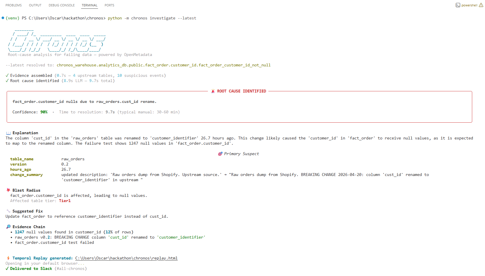
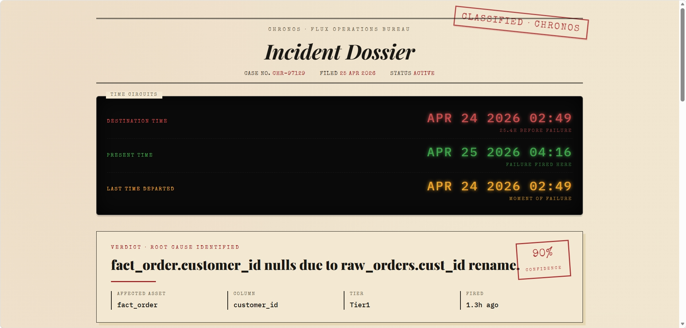
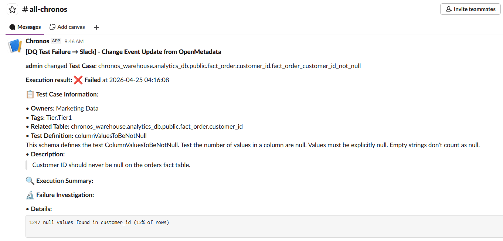
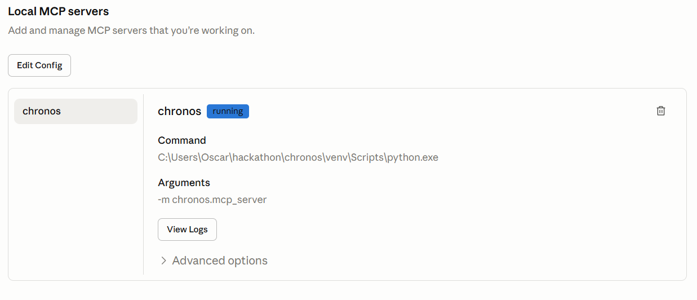
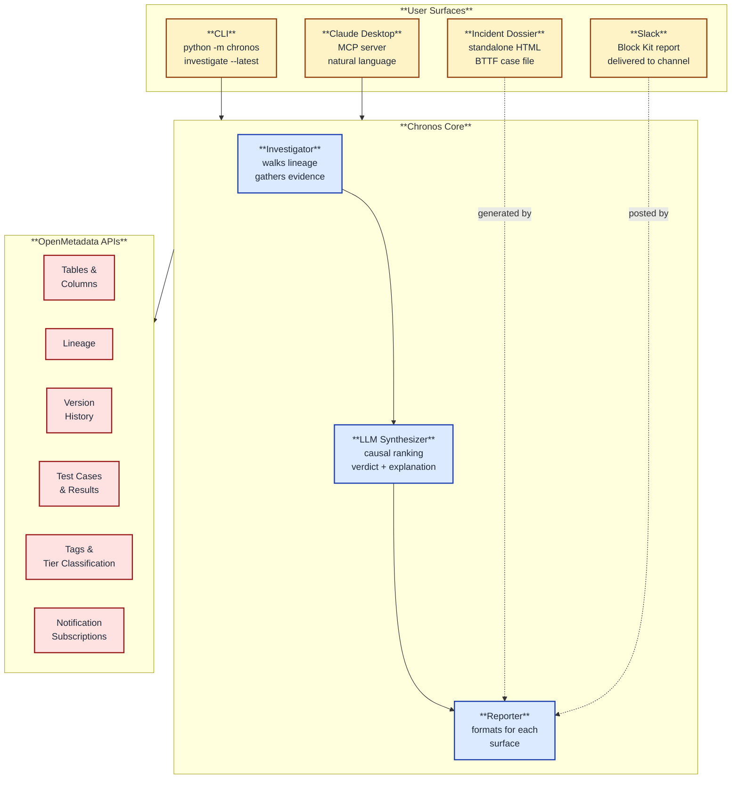

<div align="center">

# 🕒 Chronos

### Root-cause analysis for failing data, in the time it takes to read a Slack message.

[](https://wemakedevs.org)
[](https://open-metadata.org)
[](https://www.python.org/)
[](https://opensource.org/licenses/MIT)

**One command. Twelve seconds. Four surfaces. The difference between a 2 a.m. wake-up call and a 2 a.m. resolution.**

[Demo Video](#-demo) · [Quickstart](#-quickstart-60-seconds) · [How It Works](#-how-it-works) · [The Surfaces](#-four-surfaces-one-command)

</div>

---

## 🔥 The Problem

A data quality test fires at 2 a.m. The on-call engineer sees an alert in Slack:

> ⚠️ `fact_order_customer_id_not_null` — FAILED — 1,247 nulls in `customer_id`

The alert tells them **something** broke. It does not tell them **what** changed, **where** in the lineage, or **how** to fix it.

Then begins the slow ritual: open OpenMetadata, click into lineage, scroll through version history, jump into git, search for recent merges, ping the upstream team on Slack, dig into dbt models. **Thirty to sixty minutes**, every time, before any actual fix happens.

That entire investigation is mechanical. It's pattern-matching across metadata. **It should not require a human at 2 a.m.**

---

## 🚀 What Chronos Does

Chronos turns that thirty-to-sixty-minute investigation into a single command:

```bash
python -m chronos investigate --latest
```

In about twelve seconds, Chronos:

1. Pulls the failing test case from OpenMetadata
2. Walks the lineage three hops upstream
3. Pulls metadata version history for every upstream table
4. Correlates every metadata change against when the test fired
5. Uses an LLM to synthesize a plain-English root-cause verdict — with confidence, primary suspect, blast radius, and a suggested fix
6. Streams the result to four surfaces simultaneously: terminal, browser dossier, Slack, and Claude Desktop (via MCP)

The LLM is prompted with strict **causal ranking rules** (schema changes can cause nulls; ownership changes cannot) so the verdict is grounded in what's actually capable of producing the failure — not just what's most recent.

---

## 🎬 Demo

> **Demo video:** _link added on submission day_

A 2-minute walkthrough showing the full incident flow: Slack alert → CLI investigation → Incident Dossier → Slack delivery → Claude Desktop MCP invocation.

---

## 📸 Screenshots

### Terminal — One command, full investigation



### Incident Dossier — Time Circuits + Verdict



### Slack — Native OM alert + Chronos rich report



### Claude Desktop — MCP invocation in natural language



---

## ✨ Four Surfaces, One Command

Chronos publishes the same investigation to four distinct surfaces. Same brain, different ways in.

| Surface | What It Looks Like | When You'd Use It |
|---|---|---|
| **CLI** | Rich terminal output with verdict panel, confidence stamp, primary suspect, evidence chain | Developer flow — you're already in the terminal |
| **Incident Dossier** | Standalone HTML, BTTF-themed forensic case file with Time Circuits, scrubable timeline, primary-suspect annotation, click-to-inspect events | When you want a shareable incident report — no server, no install, opens in any browser |
| **Slack** | Block Kit message: header, verdict, 4-field grid, primary suspect, blast radius, suggested fix, evidence chain, link to dossier | When you need the on-call engineer to see it before they open their laptop |
| **Claude Desktop (MCP)** | Three MCP tools (`list_failing_tests`, `investigate_failure`, `investigate_latest`) callable in natural language | When the engineer is already in an AI agent — just ask "what just broke?" |

All four are produced by the same `Reporter` module. The LLM verdict is identical across surfaces.

---

## 🏛️ How It Works



### The investigation pipeline

1. **OMClient** (`chronos/om_client.py`) — typed wrapper around six OpenMetadata REST APIs. Handles retries, JWT auth, and version negotiation for OM 1.12.

2. **Investigator** (`chronos/investigator.py`) — given a failing test case FQN, walks the lineage upstream (default depth 3), pulls every upstream table's version history, classifies suspicious events, and assembles an `Evidence` bundle.

3. **LLM Synthesizer** (`chronos/llm.py`) — sends the evidence bundle to an OpenAI-compatible model with a system prompt that enforces **causal ranking rules**:
   - Class A (CAN cause failures): column renames, schema changes, breaking-change announcements in descriptions
   - Class B (CANNOT directly cause failures): owner additions, tag changes, tier changes
   - Hard rule: if any Class A event exists, it MUST be ranked as primary suspect
   
   This makes the model robust to noise — it won't pick "added owners 1 hour ago" over "renamed cust_id 6 hours ago" just because the former is more recent.

4. **Reporter** (`chronos/cli.py`, `chronos/replay.py`, `chronos/slack.py`, `chronos/mcp_server.py`) — formats the same `RootCauseReport` for each surface.

---

## 🔌 Six OpenMetadata APIs, Used End-to-End

Chronos isn't a thin wrapper over one endpoint. It uses OpenMetadata's surface area meaningfully:

| API | What Chronos Uses It For |
|---|---|
| **Tables / Columns** (`/tables`, `/tables/{fqn}`) | Identify the affected asset, get column metadata for context |
| **Lineage** (`/lineage/{entity}/{id}`) | Walk three hops upstream from the failing table to find suspect tables |
| **Version History** (`/tables/{id}/versions`, `/{version}`) | Pull every metadata change for upstream tables — this is the substrate the LLM reasons over |
| **Test Cases & Results** (`/dataQuality/testCases`, `/testCaseResults`) | List failing tests, get most-recent failure timestamp, push fresh test results during seed |
| **Tags & Tier Classification** (`/classifications`, `/tags`) | Extract Tier1 vs Tier2 status to weight blast radius severity |
| **Notification Subscriptions** (`/events/subscriptions`) | The OM-native alert that triggers the engineer to run Chronos in the first place — closes the "how does the engineer know?" loop |

The seed script (`src/seed.py`) creates a complete demo environment using these APIs end-to-end: a 5-table schema with realistic lineage, Tier1 tags, ownership, a failing DQ test, and a staged "breaking change" upstream — all reproducible with one command.

---

## 🏁 Hackathon Tracks

Chronos targets three of the **Back to the Metadata** hackathon tracks:

- **🎯 T-02 Data Observability** — Root-cause analysis for failing DQ tests is the literal text of the [issue #27282](https://github.com/open-metadata/OpenMetadata/issues) ticket.
- **🤖 T-01 MCP Ecosystem & AI Agents** — Chronos exposes itself as an MCP server with three tools, callable from any MCP-compatible agent (Claude Desktop, Cursor, etc.).
- **🤝 T-05 Community Apps** — Slack delivery makes Chronos a true community-grade companion to OpenMetadata.

---

## 🚀 Quickstart (60 Seconds)

### Prerequisites

- Docker Desktop running
- Python 3.10+
- An OpenAI API key (or Anthropic — Chronos supports both)
- Optional: a Slack incoming webhook URL

### 1. Clone

```bash
git clone https://github.com/oscarosk/chronos-openmetadata.git
cd chronos-openmetadata
```

### 2. Start OpenMetadata

```bash
cd openmetadata
docker compose up -d
```

Wait ~3 minutes for all four containers to be healthy. Verify at http://localhost:8585 — admin user is `admin@open-metadata.org` / `admin`.

### 3. Install Chronos

```bash
cd ..
python -m venv venv
.\venv\Scripts\Activate.ps1   # Windows PowerShell
# source venv/bin/activate     # macOS/Linux

pip install -r requirements.txt
```

### 4. Configure

Create a `.env` file in the repo root:

```bash
OM_URL=http://localhost:8585/api/v1
OM_TOKEN=<your_om_jwt_token>
OPENAI_API_KEY=<your_openai_key>
SLACK_WEBHOOK_URL=<optional, for Slack delivery>
```

To get an OM token: log in to OpenMetadata → click your avatar → Settings → Bots → ingestion-bot → copy the token, OR generate a personal access token from your user profile.

### 5. Seed The Demo Scenario

```bash
python src/seed.py
```

This creates 5 tables with lineage, Tier1 tags, ownership, a failing DQ test, and a staged upstream column rename — all idempotent, safe to re-run.

### 6. Investigate

```bash
python -m chronos investigate --latest
```

You'll see:
- The Chronos terminal report with verdict, confidence, primary suspect
- Your default browser opens the **Incident Dossier** (`replay.html`)
- A **Slack message** lands in your configured channel
- Total time: ~12 seconds

---

## 🤖 Connecting Claude Desktop (MCP)

Chronos ships as an MCP server. To use it from Claude Desktop, edit your MCP config:

**Windows:** `%APPDATA%\Claude\claude_desktop_config.json` (or `%LOCALAPPDATA%\Packages\Claude_*\LocalCache\Roaming\Claude\claude_desktop_config.json` for Microsoft Store installs)

**macOS:** `~/Library/Application Support/Claude/claude_desktop_config.json`

```json
{
  "mcpServers": {
    "chronos": {
      "command": "/absolute/path/to/venv/bin/python",
      "args": ["-m", "chronos.mcp_server"],
      "env": {
        "PYTHONPATH": "/absolute/path/to/chronos-openmetadata",
        "OM_URL": "http://localhost:8585/api/v1",
        "OM_TOKEN": "<your_om_token>",
        "OPENAI_API_KEY": "<your_openai_key>"
      }
    }
  }
}
```

Fully quit and relaunch Claude Desktop. In a new chat, ask:

> *"What data quality tests are currently failing in OpenMetadata?"*

And then:

> *"Investigate the latest failure."*

Chronos returns the same root-cause report — same verdict, same confidence, same primary suspect — that the CLI produces.

### Verify the MCP server independently

A standalone smoke test confirms the MCP server speaks valid JSON-RPC over stdio:

```bash
python chronos/_smoke_mcp.py
```

Expected output:
```
✅ initialize responded: {'name': 'chronos', 'version': '...'}
✅ tools/list returned 3 tools:
   • list_failing_tests
   • investigate_failure
   • investigate_latest
✅ MCP server smoke test PASSED
```

---

## 📐 Project Structure

```
chronos-openmetadata/
├── chronos/                  # Core package
│   ├── __init__.py
│   ├── __main__.py           # Entry point: python -m chronos
│   ├── cli.py                # CLI commands + rich terminal rendering
│   ├── om_client.py          # OpenMetadata REST client (typed)
│   ├── investigator.py       # Lineage walker + evidence assembler
│   ├── llm.py                # OpenAI/Anthropic synthesizer with causal rules
│   ├── replay.py             # Incident Dossier HTML generator
│   ├── slack.py              # Block Kit Slack delivery
│   ├── mcp_server.py         # MCP server (stdio, 3 tools)
│   └── _smoke_mcp.py         # MCP server smoke test
├── src/
│   └── seed.py               # Reproducible demo data seeder
├── openmetadata/
│   └── docker-compose.yml    # OpenMetadata 1.12.6 stack
├── requirements.txt
├── LICENSE
└── README.md
```

---

## 🔐 Security Notes

- Secrets (`OM_TOKEN`, `OPENAI_API_KEY`, `SLACK_WEBHOOK_URL`) live in `.env`, never committed
- Slack webhook delivery is best-effort and non-fatal — if the webhook fails, Chronos still completes the investigation and returns a report on every other surface
- The MCP server runs over stdio (subprocess), no network port exposed
- All OpenMetadata API calls use JWT authentication

---

## 🛣️ Roadmap

Chronos pinpoints. The fix itself is still the engineer's call — that's a deliberate scope choice. Auto-modifying production pipelines is unsafe in most data orgs.

That said, future surfaces could include:

- **Auto-PR generation** — take the suggested fix and open a draft pull request to the dbt repo
- **Slack action buttons** — "Mark as resolved", "Ping upstream team", "Snooze for 1h"
- **Multi-failure clustering** — when 5 DQ tests fail simultaneously due to one upstream change, group them into a single incident
- **Confidence-based auto-routing** — high-confidence verdicts go straight to the suspected team's owner; low-confidence ones page on-call
- **Cost tracking** — log LLM token usage per investigation for budget reporting

---

## 🙏 Acknowledgments

Built solo over four days for the [Back to the Metadata](https://wemakedevs.org) hackathon. Powered by OpenMetadata's metadata APIs, the Anthropic Model Context Protocol, and a lot of espresso.

The Incident Dossier visual design is a love letter to two genres: 1950s detective forensic case files and the Time Circuits readout from *Back to the Future* (1985). Hence "Chronos."

---

## 📜 License

MIT — see [LICENSE](LICENSE).

---

<div align="center">

**Built by [Oscar Kandir](https://github.com/oscarosk).** Questions? Open an issue.

*Chronos. Where data investigation travels at flux speed.*

</div>